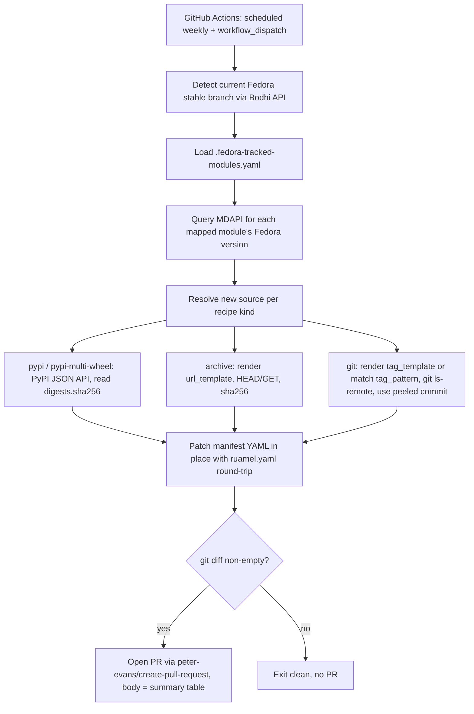

# Fedora-Stable Flatpak Dependency Pinning — Design

## Purpose

Keep every third-party dependency in the ProtonVPN Flatpak manifest (`com.protonvpn.www.yml` and its nested `pip-resources.*.yaml` files) pinned to the exact version currently shipped in **Fedora's latest stable release**, instead of "whatever upstream's latest release is." A scheduled job resolves each tracked module's Fedora-stable version, reconstructs the matching upstream source (URL + checksum, or git tag + commit), patches the manifest files in place, and opens a PR.

This replaces an earlier, incomplete, uncommitted attempt (`scripts/fedora_pip_updater/`, `.fedora-pip-mapping.yaml`, `tests/fedora_pip_updater/`, `docs/superpowers/plans/2026-05-29-fedora-pip-versions-workflow.md`) that was narrower in scope (PyPI packages only) and relied on Anitya (upstream release-monitoring data, not actual Fedora package versions). That scratch work should be deleted as part of implementation.

## Scope

**In scope — every module in `com.protonvpn.www.yml` (including everything pulled in transitively via `pip-resources.*.yaml`) that has a real Fedora package equivalent.** This includes:
- Plain PyPI packages built with `buildsystem: simple` (e.g. `packaging`, `idna`, `cryptography`, `click`, `keyring`, `aiohttp`, `jaraco.classes`, ...) — roughly 50 modules across `com.protonvpn.www.yml` and the five `pip-resources.*.yaml` files.
- Native/C-library modules built from source archives or git checkouts (`libndp`, `polkit`, `libnma`, `iproute2`, `dbus-python`).
- Native modules with an existing "don't upgrade past X" ceiling in their `x-checker-data` (`NetworkManager` — `versions: < 1.42.0`; `NetworkManager-openvpn` — `versions: < 1.10.4`). **Decision: drop these ceilings.** Always take whatever version Fedora ships. If a patch (e.g. `patches/NetworkManager/disable-ownership-check-for-plugins.patch`) stops applying because of this, that surfaces as a normal Flatpak build failure in CI/PR review — it is not this tool's job to guess compatibility.

**Out of scope — excluded entirely, keep current behavior untouched:**
- Proton-owned modules, because they are not packaged in Fedora at all: `python-proton-core`, `python-proton-keyring-linux`, `python-proton-vpn-api-core`, `python-proton-vpn-local-agent` (the `.deb`-sourced binary agent from Proton's own Debian repo), `proton-vpn-cli`, `proton-vpn-gtk-app`.
- `proton-vpn-local-agent` **PyPI wheel** (a separate, metadata-only artifact pulled into `pip-resources.python-proton-vpn-api-core.yaml`) — also a Proton package, also excluded, despite being PyPI-sourced. General rule: any package whose PyPI/Fedora name starts with `proton` is excluded regardless of which file it appears in.
- `systemd`'s vendored `python3-pefile` stays in scope (it's a genuine third-party PyPI package, not Proton's).

## Validated Technical Approach

Before finalizing this design, the following were verified live against the real services (not assumed):

1. **Determining "latest Fedora stable" automatically** — query Bodhi's `GET https://bodhi.fedoraproject.org/releases/?state=current`, filter to entries with `id_prefix == "FEDORA"` (excludes `FEDORA-CONTAINER`/`FEDORA-FLATPAK`/`FEDORA-EPEL*` variants) and a non-null `released_on` in the past, then pick the highest `version`. Confirmed this currently resolves to `f44` (Fedora 44), correctly preferring it over `f43` even though both report `state: current`. **No manual "bump the target Fedora version" step is ever needed.**

2. **Resolving a package's Fedora-stable version** — query `GET https://mdapi.fedoraproject.org/<branch>/pkg/<fedora_package_name>`, read the `version` field. Confirmed against `NetworkManager` (1.54.3), `python3-cryptography` (46.0.7), `python3-idna` (3.11), `python3-gobject` (3.56.2), `libndp` (1.9), `polkit` (127), `python3-cairo` (1.28.0), `python3-gnupg` (0.5.4), `python3-jaraco-classes` (3.4.0), `python3-dbus-fast` (2.45.1). A 404 means the package isn't in that Fedora branch — treated as a skip, not a hard error.

3. **Resolving a PyPI-backed source for a known version** — query `GET https://pypi.org/pypi/<name>/<version>/json` and read `urls[].digests.sha256` directly from the response. **We do not need to download the artifact and hash it ourselves** — PyPI already publishes the sha256 for every file. Confirmed with `idna==3.11`.

4. **Resolving an archive-backed source for a known version** — render the module's known `url-template` (e.g. `https://github.com/jpirko/libndp/archive/v$version.tar.gz`) with the target version, then `HEAD` it to confirm it resolves before treating it as the new source (still needs a `GET`+sha256 for real use). **Confirmed this can go stale**: `polkit`'s current `url-template` (`https://gitlab.freedesktop.org/polkit/polkit/-/archive/$version/polkit-$version.tar.gz`) 404s for version `127`, because upstream polkit moved to `https://github.com/polkit-org/polkit`. The correct current URL (`https://github.com/polkit-org/polkit/archive/refs/tags/127.tar.gz`) was confirmed to resolve. **Consequence: the migration step that builds the tracked-module mapping must verify each `url_template` against the module's current Fedora version, not blindly copy the existing `x-checker-data.url-template` out of the manifest.**

5. **Resolving a git-tag-backed source for a known version** — render the module's `tag_template` (e.g. `$version`) or match its `tag-pattern` (e.g. `^v([\d.]+)$`), then `git ls-remote --tags <repo_url>` and look for that tag. Confirmed against NetworkManager.git for tag `1.54.3`: it returns **two** lines, one for `refs/tags/1.54.3` (the tag object) and one for `refs/tags/1.54.3^{}` (the peeled/dereferenced commit). **The peeled hash is what must be used for the manifest's `commit:` field** — annotated tags point at a tag object, not a commit, and Flatpak needs the actual commit.

6. **Guessing a Fedora package name from a PyPI name** — Fedora packages provide a normalized capability `python3dist(<name>)` following PEP 503 normalization (lowercase, `.`/`_` → `-`), and the binary RPM is conventionally `python3-<normalized-name>` (confirmed: `jaraco.classes` → `python3-jaraco-classes`, `python-gnupg` → `python3-gnupg`, `pycairo` → `python3-cairo` — note this one does *not* follow the naive `python3-<pypi-name>` pattern, so guesses still need verification). This convention is a useful **starting guess** when building the mapping file, but every guess must be confirmed to resolve via MDAPI before being committed — never trust the convention blindly.

## Architecture



## Components

### `.fedora-tracked-modules.yaml` (repo root)

Single source of truth. Keyed by the exact Flatpak module `name` as it appears in the manifest tree. Each entry declares everything needed to reconstruct a source from a Fedora version string:

```yaml
modules:
  python3-cryptography:
    fedora_package: python3-cryptography
    recipe: pypi-multi-wheel
    pypi_name: cryptography
    wheel_arches: [aarch64, x86_64]

  python3-idna:
    fedora_package: python3-idna
    recipe: pypi
    pypi_name: idna
    prefer: wheel

  libndp:
    fedora_package: libndp
    recipe: archive
    url_template: "https://github.com/jpirko/libndp/archive/v$version.tar.gz"

  polkit:
    fedora_package: polkit
    recipe: archive
    url_template: "https://github.com/polkit-org/polkit/archive/refs/tags/$version.tar.gz"

  NetworkManager:
    fedora_package: NetworkManager
    recipe: git
    repo_url: "https://gitlab.freedesktop.org/NetworkManager/NetworkManager.git"
    tag_template: "$version"

  systemd:
    fedora_package: systemd
    recipe: git
    repo_url: "https://github.com/systemd/systemd.git"
    tag_pattern: "^v([\\d.]+)$"
```

Recipe kinds:
- `pypi` — single wheel or sdist, `prefer: wheel|sdist` picks which to use when both exist.
- `pypi-multi-wheel` — the `cryptography` special case: multiple `only-arches`-scoped wheel sources in the manifest, one per arch, each needs its own URL+sha256 for the same resolved version.
- `archive` — render `url_template`, fetch, compute sha256.
- `git` — render `tag_template` (exact substitution) or find the first tag matching `tag_pattern`, resolve via `git ls-remote --tags`, use the peeled (`^{}`) hash when present, else the plain hash.

Proton-owned modules (listed in Scope above) are **not present in this file at all** — the tool only ever acts on modules it finds an entry for.

### `scripts/fedora_flatpak_updater/` (new, replaces the deleted scratch package)

- `fedora_release.py` — calls Bodhi, returns the current stable branch string (e.g. `"f44"`).
- `mdapi_client.py` — thin client for `mdapi.fedoraproject.org/<branch>/pkg/<name>`; per-run in-memory cache; raises a typed `PackageNotFoundError` on 404.
- `recipes/pypi.py` — implements `pypi` and `pypi-multi-wheel`.
- `recipes/archive.py` — implements `archive`.
- `recipes/git.py` — implements `git`, including peeled-tag resolution.
- `manifest_patcher.py` — `ruamel.yaml` (round-trip mode) based. Walks `com.protonvpn.www.yml` and all `pip-resources.*.yaml`, finds every source block belonging to a given module `name` (a module name may appear more than once in the tree, e.g. `python3-flit_core`), and mutates only `url`/`sha256`/`tag`/`commit` fields in place — comments, key order, and YAML anchors/aliases (used in `pip-resources.proton-vpn-gtk-app.yaml` and others) must be byte-identical elsewhere.
- `cli.py` — orchestrates a full run. Flags: `--dry-run`, `--only <module-name>` (repeatable, for local debugging). Always prints a final summary table (updated / unchanged / skipped-with-reason).

### Manifest changes

For every module now covered by `.fedora-tracked-modules.yaml`, remove its `x-checker-data` block from the manifest source entry. `flatpak-external-data-checker` (Flathub's own bot) only checks sources that carry `x-checker-data`, so removing it stops that bot from fighting this tool's pinned versions. Proton-owned modules keep their existing `x-checker-data` untouched.

### Workflow

`.github/workflows/update-fedora-flatpak-deps.yml`:
- Triggers: weekly `schedule` cron + `workflow_dispatch`.
- Steps: checkout → set up Python → install deps → run `python -m fedora_flatpak_updater.cli` → if `git diff --quiet` reports changes, open a PR via `peter-evans/create-pull-request` with the run's summary table as the PR body; otherwise exit cleanly with no PR.

## Error Handling

- **Bodhi lookup fails** → hard fail, retry once, then exit non-zero with a clear message. Nothing else can proceed without a target branch.
- **MDAPI 404** (package not in this Fedora branch) → skip module, record reason, continue.
- **MDAPI 5xx** (transient) → retry once, then skip + record.
- **Recipe resolution fails** (PyPI doesn't have that exact version; archive URL 404s; git tag not found upstream for that version string) → skip module, record the specific reason (e.g. `"tried tag 1.54.3 on NetworkManager.git, not found"`), continue.
- **No modules changed** → CLI exits 0 with "nothing to update"; workflow skips PR creation.
- Every run ends with a summary table (updated / unchanged / skipped-with-reason) that becomes the PR body, so a human can see at a glance what needs manual follow-up.

## Testing Strategy

All HTTP and `git` calls are mocked in unit tests — no real network access in the test suite.

- `test_fedora_release.py` — mocked Bodhi JSON, verifies branch selection (filters container/flatpak/EPEL variants, excludes unreleased, picks highest version).
- `test_mdapi_client.py` — mocked HTTP, verifies version extraction and 404/5xx handling.
- `test_recipes_pypi.py` — mocked PyPI JSON, verifies wheel/sdist selection and the `cryptography` multi-arch case.
- `test_recipes_archive.py` — mocked HTTP, verifies URL templating and sha256 computation.
- `test_recipes_git.py` — mocked `git ls-remote` output, verifies tag-template rendering, tag-pattern matching, peeled-hash preference, and the not-found skip path.
- `test_manifest_patcher.py` — real small fixture YAML files (including an anchor/alias pair and a duplicated module name), verified byte-for-byte identical except the intended fields, using `ruamel.yaml`.
- `test_cli.py` — full orchestration with everything mocked: `--dry-run`, summary output, skip/failure aggregation.

## Migration Plan (build the initial mapping file)

1. Reuse a recursive manifest walker (similar to the discarded `inventory.py`) to enumerate every module in `com.protonvpn.www.yml` and all `pip-resources.*.yaml`, excluding Proton-owned modules per Scope.
2. For PyPI-backed modules, guess `fedora_package` as `python3-<PEP503-normalized-name>`, then verify the guess resolves via MDAPI; hand-fix the ones that don't (e.g. `pycairo` → `python3-cairo`, `pygobject` → `python3-gobject`).
3. For the ~10 native/archive/git modules, hand-write the recipe using the existing `x-checker-data` as a starting point, but verify each `url_template`/`tag_template` actually resolves for the module's *current* Fedora version before committing it (the `polkit` case shows why).
4. Remove `x-checker-data` from every module now covered by the mapping file.
5. Delete the old scratch work: `scripts/fedora_pip_updater/`, `.fedora-pip-mapping.yaml`, `tests/fedora_pip_updater/`, `docs/superpowers/plans/2026-05-29-fedora-pip-versions-workflow.md`.

## Known Limitations (accepted, not solved by this design)

- `python3-bcrypt` vendors Rust crate sources in `bcrypt-cargo-sources.json` (for offline Cargo builds). Bumping `bcrypt`'s version can change its Cargo dependency graph, which this tool does not regenerate. If `bcrypt`'s Fedora version changes, the PR will need a manual `flatpak-cargo-generator` run before it can build — call this out explicitly in that module's mapping entry (e.g. a `manual_followup` note) so the PR description flags it.
- Dropping the `NetworkManager`/`NetworkManager-openvpn` version ceilings (per the accepted decision) means a build breakage from an incompatible jump is expected to be caught by normal CI, not preemptively guarded against here.
