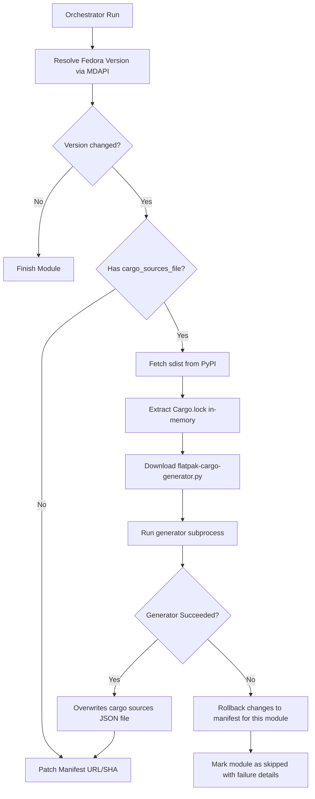

# Automated Cargo Lockfile Updates for Rust-based Python Extensions

## Purpose

Automate the extraction of `Cargo.lock` and regeneration of Flatpak Cargo sources JSON files (e.g., `bcrypt-cargo-sources.json`) inside the `fedora_flatpak_updater` tool. This removes the manual developer follow-up step when Rust-based Python dependencies (such as `bcrypt`) are updated to their Fedora-stable versions.

## Scope

* **In Scope**:
  * Python dependencies mapped in `.fedora-tracked-modules.yaml` that are built from source containing native Rust extensions (e.g. `python3-bcrypt`).
  * Automated download of PyPI source distribution (`sdist`) archives to extract locked Rust dependencies.
  * In-memory extraction of `Cargo.lock` from the `sdist` archive.
  * Subprocess execution of `flatpak-cargo-generator.py` to rebuild Cargo source JSON documents in-place.
  * Continued use of Fedora-stable package versions for all Python dependencies.
* **Out of Scope**:
  * Re-resolving other Python dependencies using Python lockfiles (like `poetry.lock` or `uv.lock`) — Python dependencies will continue to match Fedora-stable package versions directly.
  * Python packages distributed as pre-compiled wheels (e.g. `cryptography`), since they do not compile Rust from source in this Flatpak.

## Technical Approach

1. **Mapping Configuration**:
   Enhance `.fedora-tracked-modules.yaml` to specify fields for Rust/Cargo packages:
   * `cargo_sources_file`: Relative file path to the output Cargo source JSON (e.g., `bcrypt-cargo-sources.json`).
   * `cargo_lock_path`: Relative internal path of `Cargo.lock` inside the `sdist` archive (e.g. `src/_bcrypt/Cargo.lock`).

2. **Downloader for `flatpak-cargo-generator.py`**:
   Fetch `flatpak-cargo-generator.py` dynamically from Flathub upstream:
   * URL: `https://raw.githubusercontent.com/flatpak/flatpak-builder-tools/master/cargo/flatpak-cargo-generator.py`
   * It will be downloaded to a temporary location using `requests` and cached for the duration of the execution.

3. **Archive Extraction**:
   * Get the `sdist` URL for the target Python package version via the PyPI JSON API: `https://pypi.org/pypi/<package_name>/<version>/json`.
   * Download the sdist archive `.tar.gz` or `.zip` file.
   * Parse the archive using Python's built-in `tarfile` or `zipfile` modules and extract the content of the file matching `cargo_lock_path` in-memory.
   * **Path Resolution**: The configured `cargo_lock_path` is relative to the sdist archive's root. The updater will automatically inspect the archive's top-level directory (e.g. `bcrypt-4.3.0/`) and prepend it to the lookup path.

4. **Sources Reconstruction**:
   * Write the extracted `Cargo.lock` contents to a temporary file.
   * Execute the downloaded generator script via a subprocess:
     ```bash
     python3 flatpak-cargo-generator.py -o <cargo_sources_file> <temp_cargo_lock>
     ```
   * Ensure temporary files are cleaned up immediately following completion.

## Architecture



## Error Handling

* **PyPI / Network Failures**: 
  * If sdist download or PyPI JSON API metadata calls time out or fail, catch the error, log a detailed warning, and skip updating the Cargo sources for that run.
* **Missing Lockfile**:
  * If the specified `cargo_lock_path` is not present in the sdist archive, log a warning and mark the Cargo updates as skipped.
* **Generator Subprocess Exit Code**:
  * If `flatpak-cargo-generator.py` exits with a non-zero code, log stderr, roll back manifest updates for this module, mark the module as `skipped` in the final summary report with the failure details, and keep the PR buildable.

## Testing Strategy

All network and subprocess calls will be mocked in pytest:
* `test_cargo_automation.py` will:
  * Mock PyPI JSON response and file download.
  * Construct a fake sdist `.tar.gz` containing a mock `Cargo.lock` in-memory.
  * Mock `subprocess.run` calls, checking that the command line matches `python3 flatpak-cargo-generator.py -o bcrypt-cargo-sources.json ...`.
  * Validate that the generator is executed only when the version actually upgrades.
  * Validate failure rollback behavior.

